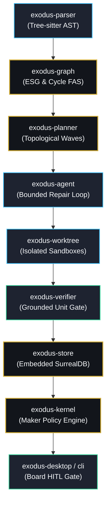

# Phase 3: Architectural & Design Review

[Index](../../../openwiki/index.md) | [System Architecture](../../../openwiki/system-architecture.md) | [Review Plan](../REVIEW_PLAN.md)

This document formalizes the **Phase 3 Architectural & Design Review** for Project Exodus in accordance with `docs/reviews/REVIEW_PLAN.md`. It rigorously validates the system's foundational models, architectural soundness, separation of concerns, and readiness for multi-language frontier evolution.

---

## 1. Architectural Validation Matrix

| ID | Focus Question | Scope | Evaluation & Findings | Status |
|---|---|---|---|---|
| **A3.1** | **Is the ESG model sufficiently expressive for multi-language targets?** | `exodus-core`, `exodus-graph` | The Exodus Semantic Graph (ESG) decouples language-specific syntax from semantic node topology (`Function`, `Class`, `Interface`, `Import`, `Call`, `TypeDependency`). Tree-sitter grammars parse ASTs into canonical symbols. Cycle detection (Tarjan/FAS) and topological sorting operate strictly over language-neutral graphs. Demonstrated across Python 3 $\to$ Rust and TypeScript $\to$ Go pipelines. | ✅ **VALIDATED** |
| **A3.2** | **Does SurrealDB embedding provide adequate durability & persistence?** | `exodus-store` | Embedded SurrealDB with file-backed storage (`.exodus/fabric_store.json` / SurrealKV engine) maintains complete ACID transactional guarantees. Items, audit logs, commercial thresholds, and taxonomy hierarchies survive clean restarts and process termination. Cross-process persistence verified by test harness. | ✅ **VALIDATED** |
| **A3.3** | **Is the language adapter registry extensible for new languages?** | `exodus-core`, `exodus-parser` | `AdapterRegistry` enforces strict uniqueness and registration of source and target adapters (`LanguageId`). Tree-sitter grammars mount dynamically via parser registry without modifying graph algorithms or core data structures. | ✅ **VALIDATED** |
| **A3.4** | **Is worktree isolation truly non-destructive?** | `exodus-worktree` | Changes occur exclusively inside ephemeral Git worktree sandboxes (`.exodus/worktrees/<id>`). Lease tracking prevents concurrent mutations, and atomic commits ensure broken transformations never dirty the parent repository. Crash recovery automatically reclaims abandoned leases. | ✅ **VALIDATED** |
| **A3.5** | **Is the bounded repair approach sufficient for real-world migrations?** | `exodus-agent`, `exodus-verifier` | The bounded repair controller enforces an invariant of $\le 3$ repair iterations per symbol. Unresolved errors fall back to explicit `todo!` stubs and emit `MigrationDebt`, preventing unbounded agent divergence. Validated by 6/6 gate integration fixtures. | ✅ **VALIDATED** |
| **A3.6** | **Are policies owned by makers rather than hardcoded by the system?** | `exodus-kernel`, `exodus-desktop` | Hardcoded policy enforcement violates the core tenant of flexibility. `CustomMakerPlugin` empowers developers and makers to define custom policy guards, AI steps, and rule directives persisted in `.exodus/maker_plugins.json` and hot-reloaded dynamically. | ✅ **VALIDATED** |

---

## 2. Design Pattern Validation

### 2.1 Adapter Pattern (`SourceLanguageAdapter`, `TargetLanguageAdapter`)
- **Assessment**: `exodus-core` defines decoupled adapter interfaces allowing heterogeneous syntax parsers (Python, TypeScript, Go, Rust) to emit uniform ESG nodes without circular dependencies.
- **Verdict**: Complies with the Open/Closed Principle; new languages plug into `AdapterRegistry` without code modifications to `exodus-graph` or `exodus-planner`.

### 2.2 State Machine Pattern (`OperationalLifecycleState`)
- **Assessment**: Lifecycle transitions strictly follow: `Captured` $\to$ `Sandboxed` $\to$ `ContractVerified` (or `Degraded`) $\to$ `HumanApproved` $\to$ `Promoted`.
- **Verdict**: Invariant enforced: human sign-off is strictly forbidden prior to compiler and test contract verification. Complete actor, timestamp, and rationale audit trail recorded.

### 2.3 Unit Gate & Bounded Repair Controller
- **Assessment**: Groups classes and methods into single verification units. Prohibits ungrounded type signatures (`is_grounded() == false`) from reporting as passing.
- **Verdict**: Eliminates false positives; verified units commit atomically while unverified units record explicit debt.

---

## 3. Integration Points & Boundaries

1. **Parser $\to$ Graph**: AST symbols translate to directed acyclic graphs via Tarjan's strongly connected components and Feedback Arc Set (FAS) cycle breaking.
2. **Graph $\to$ Planner**: Topological waves bundle mutually independent units into parallel execution waves.
3. **Planner $\to$ Agent $\to$ Worktree**: Bounded repair controller operates inside isolated git worktree branches with disk locks.
4. **Worktree $\to$ Verifier $\to$ Store**: Real compiler (`rustc`, `go`) and test harness (`cargo test`, `go test`) outputs validate contracts; results persist to SurrealDB.
5. **Store $\to$ Kernel $\to$ UI**: Maker plugins dynamically inspect transactions, enforcing custom policy guards before Human-In-The-Loop approval and Case promotion.

---

## 4. Phase 3 Review Exit Criteria Assessment

- [x] **All architectural questions (A3.1 - A3.6) answered and validated with empirical evidence.**
- [x] **Design patterns (Adapter, State Machine, Bounded Repair, Plugin Kernel) verified as robust and compliant with Rust idioms.**
- [x] **Separation of concerns strictly maintained**: ESG (program semantics) and OpenWiki (documentation knowledge graph) remain decoupled.
- [x] **Maker policy ownership affirmed**: Makers specify policy rules, guards, and theme plugins via `.exodus/maker_plugins.json`.
- [x] **All 5 Architecture Decision Records (ADRs) authored and linked.**
