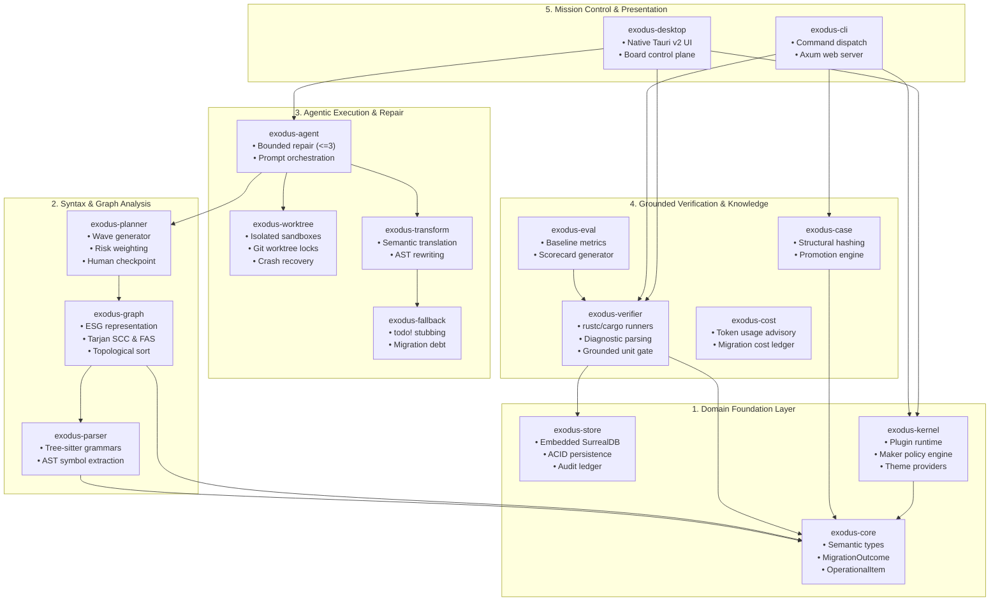
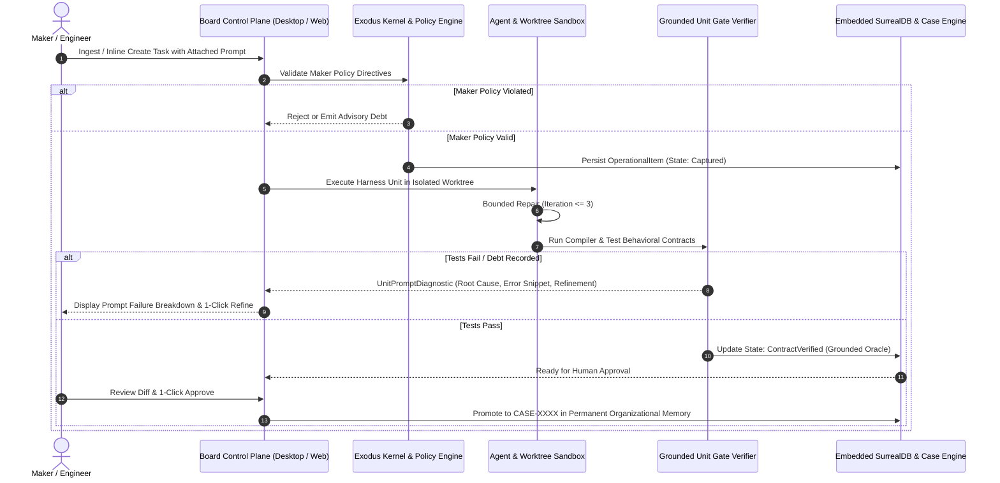

# Architecture Diagrams & Structural Blueprints

[Index](../../../../openwiki/index.md) | [System Architecture](../../../../openwiki/system-architecture.md) | [Decisions](../decisions.md)

This document collects architectural and system topology diagrams for Project Exodus, visualizing data flow, crate dependencies, execution boundaries, and human-in-the-loop control loops.

---

## 1. Workspace Crate Topology & Responsibility Matrix



---

## 2. 6-Stage Human-in-the-Loop Operational Closed Loop



---

## 3. Separation of Concerns Model

```text
┌───────────────────────────────────────────────────────────┐
│              PROJECT EXODUS ARCHITECTURE                  │
├─────────────────────────────┬─────────────────────────────┤
│   Exodus Semantic Graph     │  OpenWiki Knowledge Base    │
│   (Program Semantics Model) │   (Documentation Model)     │
├─────────────────────────────┼─────────────────────────────┤
│ • AST Nodes & Symbols       │ • OKF v0.2 Markdown Pages   │
│ • Cycles & FAS Resolution   │ • Repository Claims         │
│ • Unit Clusters & Waves     │ • Provenance & Traceability │
│ • Tarjan Algorithm          │ • System Architecture Guides│
│ • Code Transformation       │ • Architecture Decision Recs│
└─────────────────────────────┴─────────────────────────────┘
              ▲                             ▲
              │                             │
              └──────── STRICTLY DECOUPLED ─┘
```
